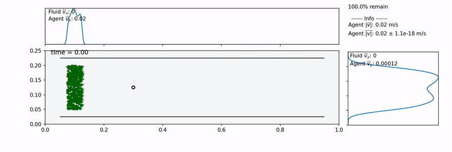

# Planktos

**Agent-based modeling of small organisms within fluid flows around immersed structures.**

[](https://github.com/mountaindust/Planktos/actions/workflows/tests.yml)
[](https://planktos.readthedocs.io)
[](https://doi.org/10.1007/s11538-022-01027-1)
[](LICENSE)



*Alignment-only (Vicsek) agents in unsteady flow past an immersed cylinder, with
periodic boundaries. Generated by `examples/ex_vicsek_model_2d.py` in this repository.*

Planktos simulates point-particle organisms small enough that their effect on the 
surrounding fluid is negligible (such as plankton, larvae, tiny insects) as they 
move through 2D or 3D fluid velocity fields, including flow around immersed 
structures such as macrophyte beds, protective layers, or larger organisms. 
Agent behavior can be specified by ODEs, SDEs, or arbitrary code.

This is an active research project and work is ongoing — see 
[releases](https://github.com/mountaindust/Planktos/releases) for the latest version.

## Quickstart

```bash
git clone https://github.com/mountaindust/Planktos.git
cd Planktos
pip install .
cd examples
python basic_ex_2d.py
```

FFmpeg is required for saving animations. Full installation instructions,
including VTK and PyVista dependencies, are in the
[documentation](https://planktos.readthedocs.io) and below.

## Capabilities

- Arbitrary agent behavior via ODEs, SDEs, or coded movement algorithms
- Time-dependent CFD velocity fields loaded from VTK or NetCDF
- Immersed structures from STL meshes (3D, static) or IB2d/IBAMR vertex data
  (2D, static or moving)
- Agents treat immersed meshes as solid, with sliding or sticky collisions
- Visualization as images or animations, with kernel density estimation
- Finite-time Lyapunov exponent analysis of the velocity field

## Acknowledgement and Funding

**If you use this software in your project, please cite the following paper:**  
- Strickland, W.C., Battista, N.A., Hamlet, C.L., Miller, L.A. (2022). Planktos: An agent-based modeling framework for small organism movement and dispersal in a fluid environment with immersed structures. *Bulletin of Mathematical Biology*, 84(72).  

Additionally, the documentation can be cited as:  
- Strickland, W.C. (2017). *Planktos agent-based modeling framework, software documentation*. https://planktos.readthedocs.io.

A suggested BibTeX entry for both of these is included in [Planktos.bib](Planktos.bib).

This project is supported by the National Science Foundation through award 
number DMS-2410988, 2024-2027. The opinions, findings, and conclusions or 
recommendations expressed here are those of the author(s) and do not necessarily 
reflect the views of the National Science Foundation.

## Installation & Dependencies

### Installing FFmpeg

Before using Planktos, FFmpeg must be installed and accessible via the `$PATH` environment variable in order to save video files of simulation results.

There are a variety of ways to install FFmpeg, such as the [official download links](https://ffmpeg.org/download.html), or using your package manager of choice (e.g. `sudo apt install ffmpeg` on Debian/Ubuntu, `brew install ffmpeg` on OS X, etc.).

Regardless of how FFmpeg is installed, you can check if your environment path is set correctly by running the `ffmpeg` command from the terminal, in which case the version information should appear, as in the following example (truncated for brevity):

```
$ ffmpeg
ffmpeg version 4.3.1 Copyright (c) 2000-2020 the FFmpeg developers
  built with gcc 10.2.1 (GCC) 20200726
```

> **Note**: The actual version information displayed here may vary from one system to another; but if a message such as `ffmpeg: command not found` appears instead of the version information, FFmpeg is not properly installed.

### Installing Planktos

Once FFmpeg is installed, Planktos can be installed from source using `pip` on 
Python >= 3.8 from the Planktos directory. Navigate to the Planktos directory in 
a terminal and use the command:

```
pip install .
```
Non-optional dependencies (other than FFmpeg) should automatically be installed.

Planktos is still in active development and updates occur often. You should 
therefore pull the source repo often and then reinstall using the same command. 
To avoid needing to reinstall each time you pull the repo, you can instead 
install Planktos in "editable" mode (requires pip version >= 21.1):

```
pip install -e .
```

Planktos can then be imported like any other Python package from any directory. 
Either approach also allows you to uninstall with the same command (from the 
Planktos directory):

```
pip uninstall .
```

### Running Directly From Source (no install)

The dependencies are as follows. It is recommended that everything comes from 
conda-forge since there can be issues mixing packages from conda-forge and the 
default channel.

- Python 3.8+ 
- numpy >= 1.19
- scipy >= 1.10.1 (earlier versions have a broken interpn)
- matplotlib >= 3.0
- pandas
- vtk >= 9.2 (if loading vtk data, get from conda-forge and use mamba. conda seems to 
break itself trying to install vtk for some reason, and takes an hour to try and 
solve the dependencies in the process.)
- pyvista >= 0.44 (if saving vtk data, get from conda-forge and use mamba. same problem 
as for vtk.)
- numpy-stl >= 2.16.3 (if loading stl data, get from conda-forge)
- netCDF4 >= 1.5.7 (if loading netCDF data, comes standard with an Anaconda installation)
- pytest (if running tests)

### Tests
All tests can be run by typing `pytest` into a terminal in the base directory. 
This requires installation of the optional pytest package. Add `--runslow` to
include the slower checks (the parallelization tests and the plotting smoke
tests).

## Overview

A simulation is built from two objects.

**`Environment`** is the world: a rectangular 2D or 3D domain with boundary
conditions, a fluid velocity field, and optionally an immersed boundary mesh.
Velocity fields load from IB2d or IBAMR VTK output, COMSOL VTU, NetCDF, or are
generated analytically (Brinkman, two-layer channel, and canopy flow), and can be
tiled or extended. Immersed structures load from STL (3D, static only) or IB2d
vertex data (2D, static or moving). Fluid data is interpolated with a cubic spline
in time and linearly in space and any rectilinear grid is supported.

**`Swarm`** is a vectorized group of agents belonging to one `Environment`. Agent
state lives in NumPy arrays rather than individual objects, for speed. Per-agent
variation goes in a pandas DataFrame (`Swarm.props`), shared values in
`Swarm.shared_props`. Built-in motion includes an Itô SDE solver
(Euler–Maruyama) and inertial particle dynamics from the linearized Maxey–Riley
equation; these can be combined, and user-supplied ODEs can feed the drift term. 

To give agents custom behavior, subclass `Swarm` and override
`apply_agent_model(self, dt)` to return the agents' new positions. The way an 
agent responds to an immersed mesh collision is configurable per Swarm via 
`ib_condition` and per move via `move(..., ib_collisions=...)`:
`'sliding'` (default — movement into a boundary is projected onto it, recursively),
`'sticky'` (agents stop on contact), or `None`. Both concave and convex mesh joints
are handled, and collision detection can be parallelized across agents via the
`pool` argument. Analysis tools include 2D vorticity and finite-time Lyapunov
exponent fields.

**Note:** mesh segments are assumed not to cross except at shared vertices. Check
imported meshes with `Environment.plot_envir()`.

Runnable examples are in [`examples/`](examples/) — start with `basic_ex_2d.py`.
Full detail is in the [documentation](https://planktos.readthedocs.io).

Research that utilizes this framework can be seen in:  
- Ozalp, Miller, Dombrowski, Braye, Dix, Pongracz, Howell, Klotsa, Pasour, 
Strickland (2020). Experiments and agent based models of zooplankton movement 
within complex flow environments, *Biomimetics*, 5(1), 2.
- Strickland, Battista, Hamlet, Miller (2022). *Planktos*: an agent-based modeling 
framework for small organism movement and dispersal in a fluid environment with 
immersed structures, *Bulletin of Mathematical Biology*, 84(72).

## API reference

Full API documentation is generated from docstrings and available at
[planktos.readthedocs.io](https://planktos.readthedocs.io/en/latest/api/index.html):
[`Environment`](https://planktos.readthedocs.io/en/latest/api/Environment.html),
[`Swarm`](https://planktos.readthedocs.io/en/latest/api/Swarm.html), and the
[`motion`](https://planktos.readthedocs.io/en/latest/api/motion.html) module.

## Related projects

Planktos does not solve the fluid — it consumes velocity fields and immersed
boundary geometry produced by CFD solvers.

- **[IB2d](https://github.com/nickabattista/IB2d)** — an immersed boundary fluid
  solver with full MATLAB and Python implementations. Planktos imports IB2d
  vertex and velocity output directly, including moving 2D boundaries. The Python
  implementation was written by the author of this library.
  - Battista, N., Strickland, C., Miller, L.A. (2017). IB2d: A Python and MATLAB
    implementation of the immersed boundary method. *Bioinspiration & Biomimetics*,
    12(3), 036003.
  - Battista, N., Strickland, C., Barrett, A., Miller, L.A. (2018). IB2d Reloaded:
    an updated Python and MATLAB implementation of the immersed boundary method.
    *Mathematical Methods in the Applied Sciences*, 41(18), 8455-8480.
- **[IBAMR](https://github.com/IBAMR/IBAMR)** — an adaptive, distributed-memory
  immersed boundary solver. Planktos imports 3D IBAMR velocity data and vertex
  data via VTK.

## Development

Install in editable mode so source changes take effect without reinstalling:

```
pip install -e .
```

Tests are run with `pytest` from the base directory — see
[Tests](#tests) above.

### Pre-commit hooks (optional, one-time setup per clone)

The repository includes a [pre-commit](https://pre-commit.com) configuration
that spell checks with codespell and runs a few structural checks (valid YAML,
no leftover merge-conflict markers, no oversized files). **It does nothing
until you turn it on, and you have to do that once in every fresh clone:**

```
pip install pre-commit
pre-commit install
```

From then on the hooks run automatically on `git commit`, against staged files
only. To commit without running them:

```
git commit --no-verify
```

These hooks are a fast local echo of what GitHub Actions checks on every push.
CI remains the authority: it cannot be bypassed, and it also runs the full test
suite, which is too slow for a commit hook.
