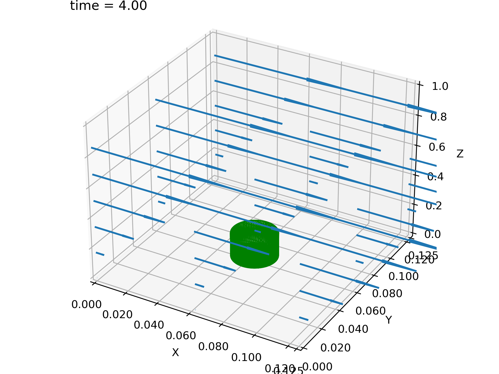
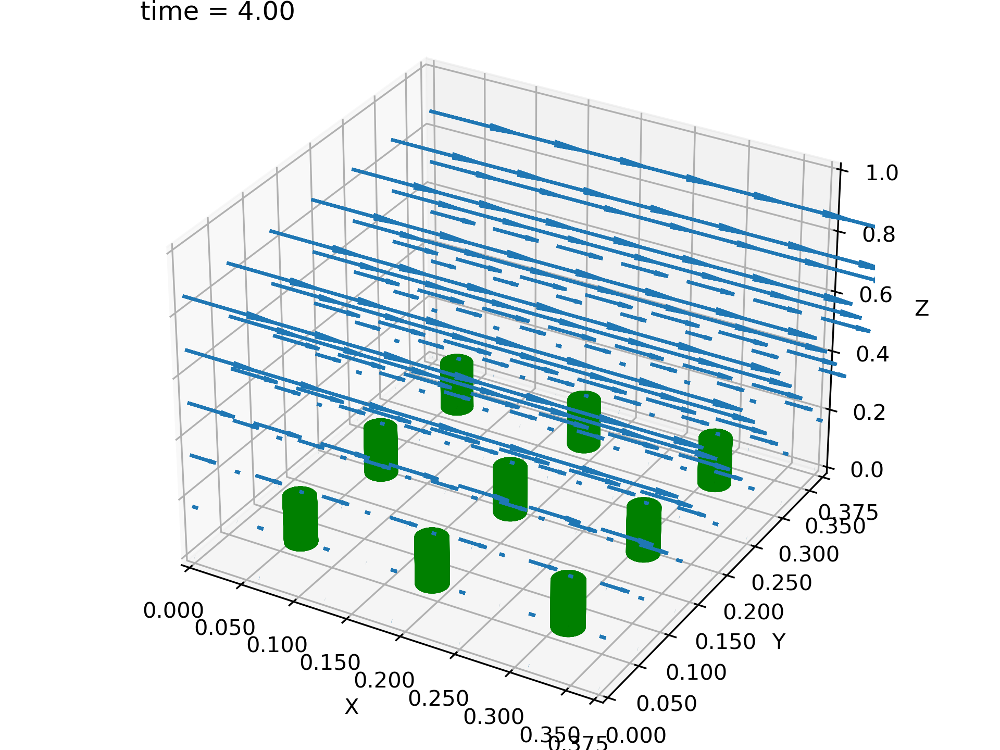
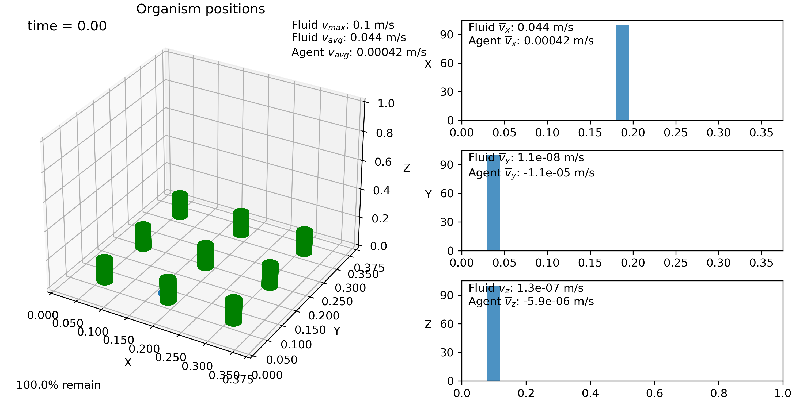

Importing 3D data and tiling (IBAMR VTK via VisIt)
--------------------------------------------------

This example is very similar to the previous one, but in 3D with data that is 
available in the tests folder. It also demonstrates the utility of the convex 
hull algorithm and demonstrates how the domain can be tiled. The script for this 
example can be found in the examples folder under the name ex_IBAMR_ibmesh.py. 
The data was generated in IBAMR. [1]_ [2]_ ::

    import sys
    sys.path.append('..')
    import planktos

    envir = planktos.environment()

Now, load the VTK data. This is just an excerpt from the larger data set, and
only file dumps 3-5 are included. So we will start at 3 and go until there
are none left. This is just a bit of data which originally came from IBAMR 
that we use for testing purposes, thus it's location in the tests folder. 
All other information is pulled from the VTK headers! ::

    envir.read_IBAMR3d_vtk_dataset('../tests/IBAMR_test_data', start=3, finish=None)

Now we read in the vertex data. Unlike the IB2d example, here we will
use a convex hull algorithm to create a solid object out of the vertex 
points. This way, we don't end up with a cylinder without a top on it! ::

    envir.read_vertex_data_to_convex_hull('../tests/IBAMR_test_data/mesh_db.vtk')
    envir.plot_flow()

This data was generated with periodic boundary conditions in the x and y
directions, simulating an infinite array of cylinders. This means that we
can tile our environment if we like, getting a bigger domain for the agents!
In this case, let's tile the environment to a 3x3 grid with respect to its
original size. ::

    envir.tile_flow(3,3)
    envir.plot_flow()

Let's add a swarm with 100 agents all positioned somewhat behind the 
center left-most cylinder with respect to the flow (which is in the 
y-direction in this example). Remember that we can do this by specifying a 
point to the init argument of the swarm class, and that we can get the 
length of the domain in each direction with the envir.L attribute.

In previous examples, our swarm plots always came with plotted estimates for 
the probability distribution of agents in each cardinal direction. This is 
done via something called Gaussian kernel density estimation (KDE), in which 
we center a Gaussian around each agent and then add them all up to get the 
curves you see. However, we can also view histograms in Planktos. Just for 
fun, let's do that for a change. ::

    swrm = planktos.swarm(envir=envir, init=(envir.L[0]*0.5, 0.04, envir.L[2]*0.1))
    swrm.plot(dist='hist')

Maybe you can JUST see the swarm behind the cylinders located near x=0.15, y=0.1!

.. [1] Griffith, B.E., Hornung, R.D., McQueen, D.M., Peskin, C.S. (2007). An
   adaptive, formally second order accurate version of the immersed boundary 
   method, *Journal of Computational Physics*, 223(1), 10-49.
.. [2] https://github.com/IBAMR/IBAMR