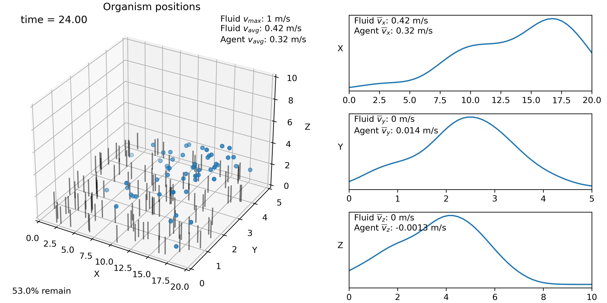

Specifying agent behavior
-------------------------

This example shows how to override parts of the swarm class in order to specify 
agent behavior. ::

    import sys
    sys.path.append('../')
    import numpy as np
    import planktos

Agent movement is defined by the get_positions method of the swarm class.
By default, the only thing this method does is call
planktos.motion.Euler_brownian_motion, which uses an Euler method to solve
an Ito SDE describing, by default, basic drift-diffusion. However, you can
do whatever you like, including:

- Solve some other SDE of the general form described in Euler_brownian_motion
- Solve a deterministic system of equations instead, using motion RK45
- Write some code to do other things, or some combination of these three.

To accomplish this, you need to subclass the swarm class and override the
get_positions method. We'll walk through this below.

Boundary conditions (including collisions with immersed mesh structures) and
updating the positions, velocities, and accelerations properties of the 
swarm will be handled automatically after the get_positions method returns.
So all you need to concentrate on is returning the new agent positions from
this function, assuming no boundary or mesh interactions occur.

It's worth looking through the planktos.motion library to see what's there.
This library contains the SDE and RK45 solvers, and has some generators for
deterministic equations of motion (which you can copy to create your own).
There are also several different methods of the swarm class which can 
provide key information for behavior. Examples include:

- positions : current positions of all agents
- get_prop() : return either shared or individual agent properties
- get_fluid_drift() : return the fluid velocity at all agent locations
- get_dudt() : return fluid velocity time derivative at all agent locations
- get_fluid_gradient() : gradient of the magnitude of fluid velocity at all
  agent locations

The subclassing and overriding itself is easy. Here we'll provide an example
where 80% of the agents move toward the mean position of the swarm (biased
random walk), while 20% do not (unbiased random walk).

First, we create a new swarm class which inherits everything from the original, 
and then we write a new get_positions method for this class. The call signature 
must remain the same as the original.  If you've never written a class method 
before, the first parameter in the call signature must always be "self". This 
refers to the swarm object itself and is *implicitly passed* whenever 
get_positions is called. In other words, you would call this method via 
swrm.get_positions(dt), and NOT "swrm.get_positions(swrm, dt)". This detail 
doesn't matter so much here; the swrm.move method is how we update swarms, and 
it will do the business of calling get_positions for us. The main thing to 
remember  is that if you need any swarm attributes or methods, you should access
them via "self.<method or attribute here>". For example, you can get the 
gradient of the fluid speed (magnitude of velocity) using self.get_fluid_gradient(). ::

    class myswarm(planktos.swarm):

        def get_positions(self, dt, params=None):
            '''New get_positions method that moves 80% of the agents toward the
            mean position of the swarm.'''

            # First, get the mean position of the swarm. 

            mean_pos = self.positions.mean(axis=0)

            # Let's assume that which agents move toward the mean is constant and
            #   determined ahead of time. Since it is an agent property and 
            #   differs across different agents, it should be stored in the 
            #   self.props DataFrame. This gets set when the swarm is created. 
            #   We'll assume it's formatted as a boolean: True means moving 
            #   toward the mean, False means you don't. We'll also assume the 
            #   property is called 'bias'.

            # There are two ways of accessing the property. One is by getting it
            #   from the self.props DataFrame directly. However, more convienent
            #   is by using the built-in method self.get_prop, since it 
            #   automatically converts DataFrame columns to numpy arrays.

            bias_bool = self.get_prop('bias')

            # Recall that if you multiply a boolean array times a numerical 
            #   array, it's like multiply times ones and zeros. So we just need 
            #   to convert our 1D bias array (a row vector) into a column vector 
            #   with a number of columns matching the spatial dimension. Then it 
            #   will match our NxD array of agent positions.

            bias_bool_tile = np.tile(bias_bool, (len(mean_pos), 1)).T

            # Get the direction of bias for each agent as a unit vector

            bias_dir = (mean_pos - self.positions)
            # divide out by norm, dealing with shape broadcasting issues
            bias_dir /= np.expand_dims(np.linalg.norm(bias_dir, axis=1),1)

            # Let's assume that if you move toward the mean, you do so by one std
            #   of your jitter (specified by the 'cov' property which is shared 
            #   among agents, assumed to be the idenity matrix times a constant).

            bias = bias_dir*bias_bool_tile*np.sqrt(self.get_prop('cov')[0,0])

            # Since this should take energy, let's also assume that the agents 
            #   with bias only have half the jitter.

            jitter_coeff = np.ones_like(bias_bool) - 0.5*bias_bool

            # OK! So we have all the information about the movement behavior we 
            #   want. Let's add the bias to fluid-based advection to get a final 
            #   drift vector for each agent, mu.
            mu = self.get_fluid_drift() + bias

            # Now let's get sigma as an NxDxD array. Remember that sigma in the 
            #   SDE is the square root of the covariance matrix, assuming that 
            #   the covariance matrix is diagonal.
            sigma = np.array([np.sqrt(self.get_prop('cov'))*jitter_coeff[ii] 
                            for ii in range(len(jitter_coeff))])

            # Finally, we will toss all this into the SDE solver to get the 
            #   resulting positions, which we return.
            return planktos.motion.Euler_brownian_motion(self, dt, mu=mu, 
                                                         sigma=sigma)

We have now defined a new swarm class, called myswarm, with our custom 
behavior. To use it, we follow the same steps as in previous examples, but
create an object out of our new class rather than the swarm class itself.

Create a 3D environment that is a bit longer in the x-direction and a bit
shorter in the y-direction (because of limits in 3D plotting, this will appear 
in plots with a square aspect ratio but everything is still correct, and the 
axes will be labeled correctly). Also, make the y-boundaries solid to agents. ::

    envir = planktos.environment(Lx=20, Ly=5, Lz=10, y_bndry=['noflux', 'noflux'],
                                rho=1000, mu=1000)
    envir.set_brinkman_flow(alpha=66, h_p=1.5, U=1, dpdx=1, res=101)

Now we create a swarm object from our new class. It inherits all methods, 
defaults, and options as the original swarm class. But we'll just go with
the default here. ::

    swrm = myswarm(envir=envir)
    swrm.shared_props['cov'] = swrm.shared_props['cov'] * 0.01

Remember that we also need a 'bias' property! Let's randomly select 20% of 
the swarm to not be biased. We'll do this so that the same number are
selected each time based off the size of the swarm (for consistency), but 
the acutal agents selected are random. ::

    num_agents = swrm.positions.shape[0]
    num_not_biased = round(num_agents*.2)
    idx_not_biased = np.random.choice(np.arange(num_agents), num_not_biased)
    bias_bool = [False if n in idx_not_biased else True for n in range(num_agents)]
    swrm.props['bias'] = bias_bool
    
    print('Moving swarm...')
    for ii in range(240):
        swrm.move(0.1)
    
    num_of_steps = len(envir.time_history) + 1
    frames = range(0,num_of_steps,5)
    
    swrm.plot_all(frames=frames)

