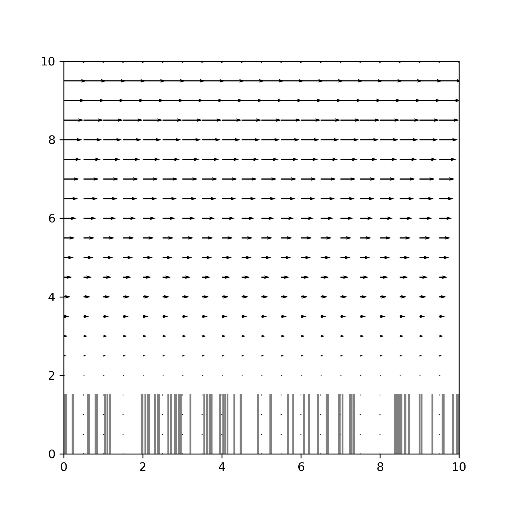

Basic 2D example
----------------

This example (along with all tutorial comments) can be found in 
examples/basic_ex_2d.py.

Depending on where your Planktos script is located, you need to add the location 
of the planktos library to your path. For instance, assuming that you are within 
the examples directory, you need to start with::

    import sys
    sys.path.append('..')
    import planktos

With that accomplished, the first thing we do is create an environment. 
The default environment is a 10 meter by 10 meter 2D rectangle in which agents 
can exit out of any side (after which they cease to be simulated). The fluid 
velocity is zero everywhere until you set it to something else. See the 
documentation of the environment class in planktos/environment.py for all the 
options! ::

    envir = planktos.environment()

Let's add some fluid velocity. First, we'll specify some (currently unrealistic)
properties of our fluid::

    envir.rho = 1000 # fluid density
    envir.mu = 1000 # dynamic viscosity

Now let's specify some Brinkman flow. See the documentation for set_brinkman_flow 
in for information on each of these fluid parameters. ::

    envir.set_brinkman_flow(alpha=66, h_p=1.5, U=1, dpdx=1, res=101)

Since this is a 2D fluid field, we can quickly visualize it to make sure 
everything looks right. Again, see documentation for options::

    envir.plot_flow()

We could also plot vorticity with envir.plot_2D_vort(), but it wouldn't look 
like much.

Now, let's add an agent swarm! Since this is a simple example, we will go with
the default agent behavior: fluid advection with brownian motion, or "jitter".
By default, the swarm class creates a swarm with 100 agents initialized to
random positions throughout the environment. We just need to tell it what 
environment it should go in by passing in our environment object:: 

    swrm = planktos.swarm(envir=envir)

Let's plot our new agents to see what we have so far, with fluid velocity arrows 
in the background::
    
    swrm.plot(fluid='quiver')

The bars that you see at the bottom denote the height of the porous layer and 
aren't really "there" in the sense that the porous layer is homogenous - Planktos 
just gives them a random distribution to mimic seagrass. To the top and right, 
you can see the Gaussian kernel density estimation for the swarm. Various 
statistics are also given.

By default, the swarm is set up with two properties that are the same across 
all agents: 'mu' and 'cov'. These are the mean drift (not counting the fluid) 
and covariance matrix for the brownian motion. 'mu' defaults to a vector of 
zeros and 'cov' to an identity matrix. Since we are working in units of meters,
that's quite a lot of jitter! Let's slow those down by editing that property::

    swrm.shared_props['cov'] = swrm.shared_props['cov'] * 0.01

It is also possible to set properties which are different between agents. For 
that, you edit the columns of swrm.props, which is a pandas DataFrame.

Now it's time to simulate our swarm's movement! We do this by calling the 
"move" method of the swarm object in a for loop. "move" takes one argument,
which is the temporal step size. For example, if we want to move the swarm
for 24 seconds with a step size of 0.1 seconds each time, we use::

    for ii in range(240):
        swrm.move(0.1)

We can see where we ended up with swrm.plot(), or we can plot a particular time 
by calling swarm.plot(time), e.g. swarm.plot(19.1). Or we can just plot 
everything as a movie with swrm.plot_all(). Run the corresponding example, 
basic_ex_2d.py in the examples folder to see this animation!

Like many functions in Planktos, plot_all has a lot of options as well. For 
example, you can generate an mp4 instead of viewing the movie directly by 
passing in a filename. You can always continue to move the swarm, even after it 
has already moved. And data about the swarm can be exported using the 
swrm.save_data function, or swrm.save_pos_to_csv if you only want the positions 
over time, or swrm.save_pos_to_vtk if you want to visualize the swarm in 
something like VisIt.

Finally, for the ultimate in interactive usage, open an ipython session and 
run the basic_ex_2d.py example using the magic command %run::

    %run basic_ex_2d.py

After it finishes running, you can interact with both the envir and swrm objects 
we just created by directly calling functions on them! This can be a useful way 
to see what kind of commands are available too. For instance, try typing ::

    swrm.

(with the period) but instead of hitting enter, hit tab. A list of attributes
and functions should appear. If you choose a function and then add a ? 
afterward, e.g.::

    swrm.plot?

The docstring will appear to give you help on what that function does and
how it works. Similarly, Jupyter notebooks are another great way to explore 
Planktos!
