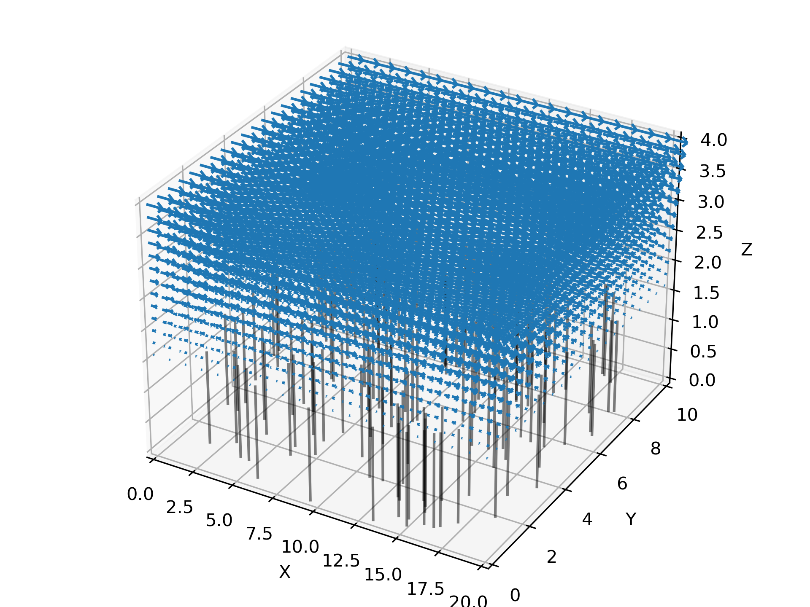
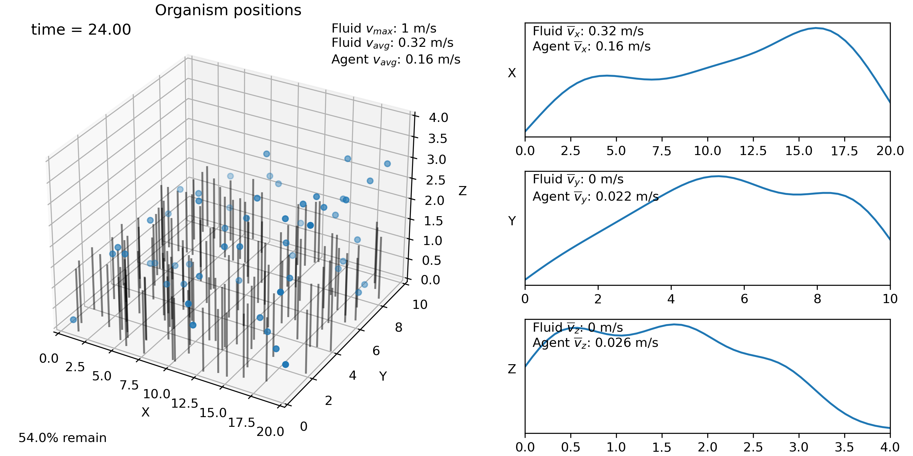

Basic 3D example
----------------

This is a minimal working example in 3D which builds on the 2D example. ::

    import sys
    sys.path.append('..')
    import planktos

To create a 3D environment in Planktos, all you need to do is specify the 
length of the third (z) dimension. Let's go ahead and specify the length
of all three dimensions this time (in meters). We'll plan on using Brinkman
flow again, so let's also go ahead and specify the fluid density and 
dynamic viscosity::

    envir = planktos.environment(Lx=20, Ly=10, Lz=4, rho=1000, mu=1000)

Now let's set the Brinkman flow. It automatically gets translated into all
available spatial dimensions::

    envir.set_brinkman_flow(alpha=66, h_p=1.5, U=1, dpdx=1, res=101)

If you decide later you want a bigger spatial domain (or you loaded fluid data
with periodic boundary conditions but want a bigger domain than the CFD
data was generated on), you can tile the environment in the x and y 
directions using the tile_flow method (this also works in 2D). You can also
extend the domain in the x or y direction by just holding the flow on the
boundary constant and translating it (extend method).

3D visualization is a hard problem in general and requires advanced libraries
specifically built for that purpose (e.g., VTK). While Planktos can read
VTK files, 3D visualization of data is not the main purpose of Planktos and
so functionality is currently limited. This may be improved in the future
by replacing matplotlib-based visualization with VTK-based visualization for
3D problems, but for now, you should not expect the aspect ratio for 3D
environments to be correct, and some features (such as vorticity plotting) 
are only available in 2D. ::

    envir.plot_flow()

Now let's repeat the steps from basic_ex_2d.py, creating a default swarm,
changing the covariance, running the simulation, and plotting. ::

    swrm = planktos.swarm(envir=envir)
    swrm.shared_props['cov'] = swrm.shared_props['cov'] * 0.01

    print('Moving swarm...')
    for ii in range(240):
        swrm.move(0.1)

This is a lot of time steps, so to speed things up a bit, we could plot just
every 5th step. plot_all wants an iterable of integers telling it which
steps to plot. There is a list of all *past* simulation times recorded in
the envir.time_history. So the total number of simulation times is given
by the length of this list plus one. ::

    num_of_steps = len(envir.time_history) + 1
    frames = range(0,num_of_steps,5)

    swrm.plot_all(frames=frames)

Here, we will just show the final time step, which is what you would see with 
the command::

    swrm.plot()

