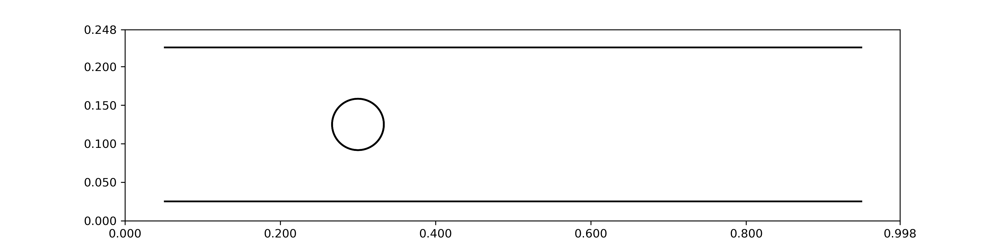
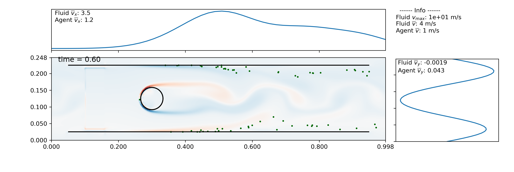

Importing VTK and vertex data (IB2d)
------------------------------------

In order to run this example, you must separately download the required data 
(about 43 MB). It can be downloaded from: 
https://drive.google.com/drive/folders/104ekG8cEJYuvk6NR8pTGn4wEISILUcuH?usp=sharing.
Put it into the ib2d_data folder in the example directory, and you should be 
good to go!

Once you have the data, this example can be found in ex_ib2d_ibmesh.py. It loads 
data generated from the `IB2d <https://github.com/nickabattista/IB2d>`_ 
Example_Channel_Flow/Example_Flow_Around_Cylinder 
example for the generated fluid velocity field and the .vertex data, 
creating an ibmesh out of it by attaching nearby points. Agents cannot move 
through the cylinder or the channel boundaries. [1]_ [2]_ [3]_ ::

    import sys
    sys.path.append('..')
    import planktos

As before, we begin by creating a default environment. It does not matter what 
the dimensions are - when we load the vtk data, it will automatically 
change shape to adjust to the data! ::

    envir = planktos.environment()

When reading in VTK data, it really helps to have access to the input2d file 
that generated the data. You need to know two basic things:

1) the time step that was taken to generate the data. this is located near 
   the top of the input2d file.
2) the print_dump value, which tells ib2d how often to print out data. It 
   can be found in the PRINTING INFORMATION section of the input2d file.

In the case of this example, dt=5.0e-5 and print_dump=1000. This means that 
each time you go from one vtk file to the next, it represents a time step
of length 5.0e-5*1000 = 0.05.

As of now, Planktos only supports reading in ascii vtk files (not binary or 
xml), though others may be supported in the future.

Read in ib2d vtk data with dt=5.0e-5, print_dump=1000. ::

    envir.read_IB2d_vtk_data('ib2d_data', 5.0e-5, 1000)

Now we read in the vertex data to get an immersed mesh. These data include 
points for two lines (the sides of the channel) and a circle representing 
the cylinder. Since the geometry is fairly simple, we should be able to 
create mesh structures out of these points by associating nearby points 
within a radius. That is, if two points are within a certain distance of 
each other, we draw a line between them. This is what the 
read_IB2d_vertex_data function does, with a default radius of approx.
half the resolution of the Eulerian, fluid velocity mesh. ::

    envir.read_IB2d_vertex_data('ib2d_data/channel.vertex')

For more complex vertex structures, this may attach too many points, causing 
problems. You can try to adjust the radius, but if the structure has concave 
features, this over-attachement can be unavoidable. In that case, try using 
add_vertices_to_2D_ibmesh, which simply adds a vertex whever mesh lines are 
crossing. It may not be ideal, but it's often good enough in a pinch! One 
thing you absolutely don't want are mesh lines crossing without a vertex 
at every crossing point. This can cause issues with the algorithm that 
handles agent-mesh collisions, resulting in agents finding their way through
the mesh. You can check things are correct by viewing just the environment 
boundaries and the mesh structures with the following command::

    envir.plot_envir()

Now we add a swarm to our environment.
Let's use the default number of agents (100), but place them all in the same
point, just to the left of the cylinder and in the middle of the channel.
The length of the domain in each direction can be obtained via the envir.L
attribute, so we'll use that to pass an (x,y) point to our swarm 
constructor as an init parameter. This tells the constructor to put all the
agents at that one point. You can also pass in a list of points to 
explicitly specify where all agents should begin individually. ::

    swrm = planktos.swarm(envir=envir, init=(envir.L[0]*0.1,envir.L[1]*0.5))

Once again, let's reduce the amount of jitter (variance). Remember that 
variance is standard deviation squared, so for a standard deviation of 0.01
(1 cm), we need a variance of 0.0001. ::

    swrm.shared_props['cov'] *= 0.0001

Now let's move the swarm with a time step of 0.025 sec, 50 times. ::

    print('Moving swarm...')
    for ii in range(50):
        swrm.move(0.025)

Things will go a little slower than in the previous examples. Planktos
automatically checks if any agent crossed any immersed boundary element
after each time step. Even in this simple example, the number of mesh 
elements is typically large (and the number of agents can be too). Even 
though we can reduce the number of mesh elements we check per agent given
how far the agent travelled in a given time step, this is still an expensive 
search-and-check, and if there is a boundary crossing, we have to 
recursively check for further crossings of different sorts after the 
vector projection of the inelastic collision. For now, these are just things 
to keep in mind... in the future, we may parallelize this part of the code
in one way or another, or rewrite all the vector algebra in C.

Planktos will create a movie if you just pass a filename with an
appropriate extension to the plot_all method of the searm object. By 
default, one frame is created per time step taken in the simulation (this
can be changed using the frames argument to plot_all), so you will likely
want to adjust the number of frames per second (fps) accordingly. Also, in 2D, 
you have the option of plotting vorticity behind the agents to better see how 
they are reacting to the fluid. Run the example script to get the full movie; 
a still partway through the simulation is shown below. ::

    swrm.plot_all(movie_filename='channel_flow_ibmesh.mp4', fps=3, fluid='vort')

Creating movies is another bottleneck in Planktos. Every frame has to be 
generated individually and then saved, and the fluid vorticity is 
calculated on-the-fly, internally. In fact, if you have 2D fluid velocity 
data but not the vorticity data, Planktos can calculate it for you and save 
the vorticity data as vtk files, either at the original time points of the
fluid data or interpolated to the simulation times. All this is to say:
if you have a simulation with a lot of time steps, there's no reason to be
making a movie with every one of those time steps as a frame! Depending on 
the fps, you'll never notice the loss of detail if you just plot every Nth
simulation step as a frame, and this is highly encouraged to cut down on 
movie generation time and file size.

.. [1] Battista, N., Strickland, C., Miller, L.A. (2017). IB2d: A Python and 
   MATLAB implementation of the immersed boundary method. *Bioinspiration & 
   Biomimetics*, 12(3), 036003.
.. [2] Battista, N., Strickland, C., Barrett, A., Miller, L.A. (2018). IB2d 
   Reloaded: an updated Python and MATLAB implementation of the immersed 
   boundary method, *Mathematical Methods in the Applied Sciences*, 41(18), 
   8455-8480.
.. [3] https://github.com/nickabattista/IB2d