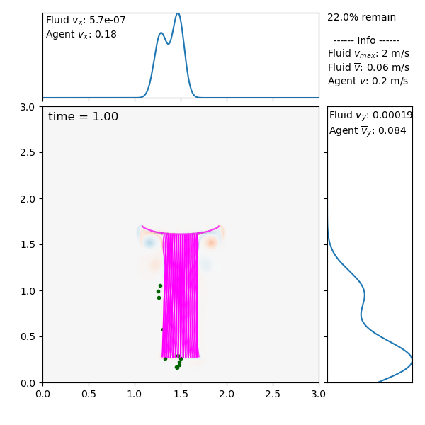

Moving immersed boundaries (sticky, IB2d)
-----------------------------------------

This example shows off the moving immersed boundary functionality of Planktos
(2D), and combines it with the sticky boundary condition. It can be found in
ex_ib2d_mvbnd_sticky.py. Agents are released near a swimming jellyfish; whenever
an agent contacts the (moving) jellyfish mesh it sticks permanently and is
removed from the plot.

In order to run this example, you must separately download the required data.
It can be downloaded from:
https://drive.google.com/drive/folders/1LGfOdLX0WJrC-v9khSpivQLhlZ_RsJIN?usp=sharing.
Put it into the ib2d_jellyfish_data folder in the example directory, and you
should be good to go! The data was generated with an
`IB2d <https://github.com/nickabattista/IB2d>`_ jellyfish example, and includes
both the fluid velocity field and the time-varying Lagrangian point data that
defines the moving mesh. ::

    from concurrent.futures import ProcessPoolExecutor
    import os
    import numpy as np
    import numpy.ma as ma
    import planktos

Loading the fluid and the moving mesh
~~~~~~~~~~~~~~~~~~~~~~~~~~~~~~~~~~~~~~~

As before, we create an Environment and load the fluid data. Here we also pass
ibmesh_color so the boundary mesh is drawn in magenta in later plots. The fluid
data is read exactly as in the static example, supplying the IB2d time step and
print_dump (here dt=1.25e-5 and print_dump=1600). ::

    envir = planktos.Environment(ibmesh_color='magenta')
    envir.read_IB2d_fluid_data('ib2d_jellyfish_data', 1.25e-5, 1600)

The mesh is where moving boundaries differ from the static case. In the static
ex_ib2d_ibmesh.py example we read a single .vertex file and connected nearby
points with the 'proximity' method. That approach does not work for a moving
boundary, where the mesh geometry changes every time step. Instead, we read the
Lagrangian point data directly: read_IB2d_mesh_data is pointed at the data
*directory* and given the same dt and print_dump as the fluid, so it can load
the sequence of lagsPts.####.vtk dumps as a time-varying mesh. By default,
consecutive Lagrangian points are connected by mesh segments; brk_idx_list lets
you break specific connections that would otherwise join the wrong points (here,
index 241). See the read_IB2d_mesh_data docstring for brk_idx_list, add_idx_list,
and the other options. ::

    envir.read_IB2d_mesh_data('ib2d_jellyfish_data', dt=1.25e-5, print_dump=1600,
                              brk_idx_list=[241])

Defining sticky, self-removing agents
~~~~~~~~~~~~~~~~~~~~~~~~~~~~~~~~~~~~~~~

We want agents that stop forever once they touch the jellyfish, and then drop
out of the plot. We do this by subclassing Swarm and using a per-agent boolean
property called 'stick'. In apply_agent_model, agents whose 'stick' is True stay
put; everyone else moves by the default drift-diffusion model. ::

    class permstick(planktos.Swarm):
        def apply_agent_model(self, dt):
            stick = self.get_prop('stick')
            all_move = planktos.motion.Euler_brownian_motion(self, dt)
            # ~stick negates the booleans; expand_dims makes the (N,) array
            #   broadcast against the (N,2) positions.
            return np.expand_dims(~stick, 1)*all_move + \
                np.expand_dims(stick, 1)*self.positions

To decide who has just stuck, we use Swarm.ib_collision_idx. This is an integer
array with one entry per agent: it is -1 if the agent did not strike an immersed
boundary element during the most recent move, and otherwise the index of the
first element it struck (so any value >= 0 indicates a collision). We override
after_move (called once all agents have finished moving and boundary
interactions are resolved) to flip 'stick' to True for those agents and mask
their positions so they disappear from future plots. ::

        def after_move(self, dt):
            self.props.loc[self.ib_collision_idx >= 0, 'stick'] = True
            self.positions[self.ib_collision_idx >= 0] = ma.masked

Creating and running the swarm
~~~~~~~~~~~~~~~~~~~~~~~~~~~~~~~~

We seed 50 agents at random positions near the jellyfish, store property history
so the 'stick' changes are recorded over time, and set the default immersed
boundary condition to 'sticky'. We then slow the jitter, give the agents a small
mean drift, and initialize every agent's 'stick' property to False. ::

    N = 50
    ICs = np.zeros((N, 2))
    ICs[:, 0] = np.random.uniform(1.1, 1.3, N)
    ICs[:, 1] = np.random.uniform(0.01, 1.3, N)

    swrm = permstick(swarm_size=N, envir=envir, init=ICs,
                     store_prop_history=True, ib_condition='sticky')

    swrm.shared_props['cov'] *= 0.001
    swrm.shared_props['mu'] = [0.2, 0.1]
    swrm.props['stick'] = np.full(N, False)

With the 'sticky' condition, an agent that runs into the boundary stops at the
point of intersection for that step (rather than sliding along it). It would be
free to move again the next step, except that our after_move has set its 'stick'
property, which apply_agent_model then uses to keep it in place.

Optionally parallelizing the collision check
~~~~~~~~~~~~~~~~~~~~~~~~~~~~~~~~~~~~~~~~~~~~~~~

Checking each agent against the moving mesh every time step is the main
bottleneck, and you can speed it up by attaching a worker pool to the Swarm via
its pool attribute. Any object exposing a .map(func, iterable) method works
(multiprocessing.Pool, or a concurrent.futures ProcessPoolExecutor or
ThreadPoolExecutor). A *process* pool is recommended for moving boundaries, which
is precisely the expensive case where parallelism pays off; thread pools and
cheap static-mesh problems can actually be slower than serial because of
per-agent dispatch overhead, so benchmark for your problem (see
tests/bench_ib_parallel.py). If you do not set pool (pool=None, the default), the
check runs serially.

With a process pool, guard the script body with ``if __name__ == '__main__':`` so
that on spawn-based platforms (Windows/macOS) the workers do not re-run the whole
script, and shut the pool down when finished. Using a ``with`` block, as below,
handles the shutdown automatically. ::

    with ProcessPoolExecutor(max_workers=os.cpu_count()) as pool:
        swrm.pool = pool
        for ii in range(42):
            swrm.move(0.025, ib_collisions='sticky')

Finally, we render the result, plotting fluid vorticity behind the agents. ::

    swrm.plot_all(movie_filename='mvbnd_sticky.mp4', fps=6, fluid='vort',
                  plot_heading=False)

Running the example script produces the mvbnd_sticky.mp4 movie, in which agents
that contact the swimming jellyfish stick to it and drop out of the simulation.
A still frame near the end of the run is shown below: the magenta mesh is the
swimming jellyfish (the moving immersed boundary), drawn over the fluid
vorticity, and most of the agents have already stuck to it and been removed,
leaving only a handful still drifting.

