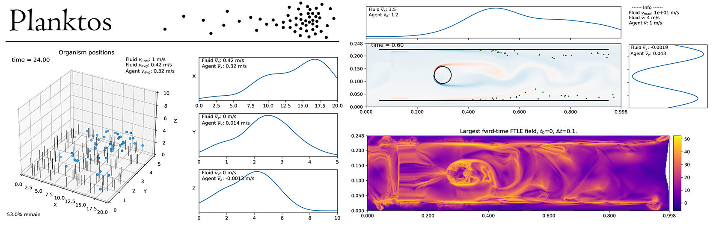

.. Planktos documentation master file, created by
   sphinx-quickstart on Sat Jul  3 11:05:11 2021.
   You can adapt this file completely to your liking, but it should at least
   contain the root `toctree` directive.

.. meta::
  :description: Planktos agent-based modeling framework documentation
  :keywords: Planktos, documentation, agent-based, modeling, fluid

===================================
Welcome to Planktos' documentation!
===================================

Planktos is an agent-based modeling framework targeted at 2D or 3D fluid 
environments. Agents in this framework are relatively tiny organisms (e.g., 
plankton or small insects) whose effect on the surrounding fluid can be 
considered negligible.

This library can be used for scientific exploration and quantification of 
collective and emergent behavior, including interaction with immersed structures. 
Functionality includes:  

* Arbitrary agent behavior utilizing ODE, SDE, or just a coded algorithm
* Loading time dependent CFD-generated velocity fields from VTK formatted data 
  files
* Loading immersed STL-formatted mesh structures and vertex points
* Data visualization as images or animations with kernel density estimation
* Velocity field analysis with respect to deterministic agent behavior via the 
  finite-time Lagrangian exponent.

If you use this software in your project, please cite it as:  

  Strickland, WC. (2018), *Planktos agent-based modeling framework*. 
  https://github.com/mountaindust/Planktos.  

A suggested BibTeX entry is included in the file 
:download:`Planktos.bib <../Planktos.bib>`.

.. toctree::
   :maxdepth: 2
   :caption: Contents:
   
   quickstart
   examples/index
   api/index

Indices and tables
==================

* :ref:`genindex`
* :ref:`modindex`
* :ref:`search`
