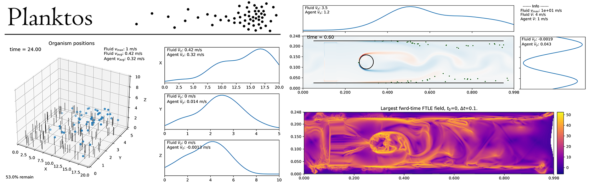

.. Planktos documentation master file, created by
   sphinx-quickstart on Sat Jul  3 11:05:11 2021.
   You can adapt this file completely to your liking, but it should at least
   contain the root `toctree` directive.

.. meta::
  :description: Planktos agent-based modeling framework documentation
  :keywords: Planktos, documentation, agent-based, modeling, fluid

===================================
Welcome to Planktos' documentation!
===================================

**Agent-based modeling of small organisms within fluid flows around immersed
structures.**

Planktos simulates point-particle organisms small enough that their effect on the
surrounding fluid is negligible (such as plankton, larvae, tiny insects) as they
move through 2D or 3D fluid velocity fields, including flow around immersed
structures such as macrophyte beds, protective layers, or larger organisms.
Agent behavior can be specified by ODEs, SDEs, or arbitrary code.

.. figure:: _static/planktos_vicsek.gif

   Alignment-only (Vicsek) agents in unsteady flow past an immersed cylinder,
   with periodic boundaries. Generated by ``examples/ex_vicsek_model_2d.py`` in
   the repository.

This is an active research project and work is ongoing -- see the
`releases page <https://github.com/mountaindust/Planktos/releases>`_ for the
latest version.

This library can be used for scientific exploration and quantification of
collective and emergent behavior, including interaction with immersed structures.
Functionality includes:

* Arbitrary agent behavior utilizing ODE, SDE, or just a coded algorithm
* Loading time dependent CFD-generated velocity fields from VTK or NetCDF 
  formatted data files
* Loading immersed STL-formatted mesh structures or vertex points. These mesh 
  structures can be time-varying in 2D, and static in either 2D or 3D.
* Agent interaction with immersed boundary meshes as solid structures
  (frictionless/sliding or sticky collisions).
* Data visualization as images or animations with kernel density estimation
* Velocity field analysis with respect to deterministic agent behavior via the
  finite-time Lyapunov exponent.

If you use this software in your project, please cite the following paper: 

  Strickland, W.C., Battista, N.A., Hamlet, C.L., Miller, L.A. (2022), 
  Planktos: An agent-based modeling framework for small organism movement and 
  dispersal in a fluid environment with immersed structures. 
  *Bulletin of Mathematical Biology*, 84(72). 

A suggested BibTeX entry is included in the file 
:download:`Planktos.bib <../Planktos.bib>`.

This project is supported by the National Science Foundation through award 
number DMS-2410988, 2024-2027. The opinions, findings, and conclusions or 
recommendations expressed here are those of the author(s) and do not necessarily 
reflect the views of the National Science Foundation.

.. toctree::
   :maxdepth: 2
   :caption: Contents:
   
   quickstart
   examples/index
   api/index

Indices and tables
==================

* :ref:`genindex`
* :ref:`modindex`
* :ref:`search`
